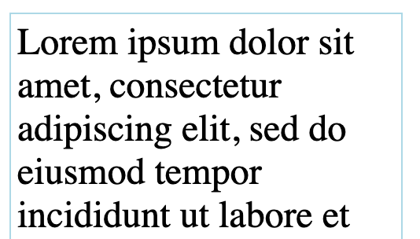

# CSS fit-width text Explainer

This proposal is an early design sketch by Blink Layout Team in Google to describe the problem below and solicit
feedback on the proposed solution. It has not been approved to ship in Chrome.

## Participate
- [csswg-drafts/issues/2528](https://github.com/w3c/csswg-drafts/issues/2528)

## Table of Contents

<!-- Update this table of contents by running `npx doctoc README.md` -->
<!-- START doctoc generated TOC please keep comment here to allow auto update -->
<!-- DON'T EDIT THIS SECTION, INSTEAD RE-RUN doctoc TO UPDATE -->

- [Introduction](#introduction)
  - [Why CSS?](#why-css)
    - [Performance](#performance)
    - [Improved User Experience](#improved-user-experience)
    - [Simplified Authoring & Maintainability](#simplified-authoring--maintainability)
- [Goals](#goals)
- [Non-goals](#non-goals)
- [Use cases](#use-cases)
  - [Expanding](#expanding)
  - [Shrinking](#shrinking)
  - [Combining behaviors](#combining-behaviors)
  - [Fitting Captions and Pull Quotes](#fitting-captions-and-pull-quotes)
  - [Aligning Text Blocks](#aligning-text-blocks)
- [[Potential Solution]](#potential-solution)
  - [Examples](#examples)
    - [Expanding](#expanding-1)
    - [Shrinking](#shrinking-1)
    - [Combining behaviors](#combining-behaviors-1)
- [Detailed design discussion](#detailed-design-discussion)
- [Considered alternatives](#considered-alternatives)
- [References & acknowledgements](#references--acknowledgements)

<!-- END doctoc generated TOC please keep comment here to allow auto update -->

## Introduction

In text layout, web authors want to align the lines with both ends of the container, but web authors want to achieve this by adjusting the font size instead of justification. Currently, there is no such method in CSS, and the only option is to manually adjust the font size through trial and error or using JavaScript.

Web authors want to fit the text into a container of a specific size without it overflowing. For example, if the container width is narrow and a long word inevitably overflows the container, web authors want to reduce the font size to make it fit within the container. Web authors want to avoid text overflowing the container due to unexpectedly long words used in text translations or when end-users provide arbitrary text.

### Why CSS?
A CSS solution elevates "fit-width text" from a complex, potentially janky scripting problem to a fundamental, performant, and easy-to-use aspect of the CSS layout system.

#### Performance
JavaScript solutions for fitting text typically involve reading element dimensions (layout reads), calculating new styles (computation), and writing new styles (layout writes). When triggered frequently (e.g., during window resizing, container resizing via ResizeObserver, or dynamic content loading), this read-compute-write cycle can lead to layout thrashing, causing jank, slow rendering, and high CPU usage. A native CSS implementation can integrate the text fitting calculation directly into the browser's existing layout and rendering pipeline. This means the fitting happens efficiently as part of the initial layout or subsequent reflows, without the overhead and potential timing issues of stepping in and out of JavaScript.

#### Improved User Experience 
JavaScript-based fitting often suffers from a "flash of unstyled content" or a visible "jump" or reflow as the text is initially rendered at one size and then resized by the script. By making text fitting a native layout property, the browser can calculate the final size/scale before or during the initial paint, resulting in text that appears correctly sized and positioned from the start, providing a much smoother and more professional user experience. This will also improve the quality of the FCP. 

#### Simplified Authoring & Maintainability
Achieving robust text fitting in JavaScript is complex. It requires handling initial load, window resizes, container resizes, potential font loading issues, minimum/maximum size constraints, different fitting methods (font size vs. scaling), and managing the state across various elements. A declarative CSS solution allows developers to achieve the desired behavior with a simple property declaration, significantly reducing the amount of code they need to write, test, and maintain. It integrates seamlessly into the CSS cascade, can be easily controlled by media queries or container queries, and reduces the reliance on complex imperative logic.


## Goals

- Provides a way to align both ends of the text with the width of the container. Consider both cases: fitting by enlarging the text and fitting by shrinking the text.

## Non-goals

- Provide a way to adjust the container width to match to the widest line.
- Provide a way to adjust font size to fit text to the container's **width and height**.
- Introduce a new line-wrapping algorithm to fit lines to the container width.

## Use cases

Publishing (news sites, blogs, magazines, portfolios) heavily relies on flexible and visually appealing typography that adapts to various layouts and screen sizes. This feature is highly relevant here, particularly for fluid & responsive headlines.  This includes: 

### Expanding

A short headline for a prominent article might look lost in a wide column on a desktop, text-grow could automatically increase its size or character/word spacing to fill the available width, creating a stronger visual impact without manual tweaking or JS calculations based on breakpoints.

* Original:<br>
  `<div>Lorem ipsum dolor sit amet, consectetur adipiscing elit, sed do eiusmod tempor incididunt ut labore et  ...`<br>
  
* A) Enlarge each line to fit them to the container width:<br>
  
* B) Enlarge all lines to fit the widest line to the container width:<br>
  


### Shrinking

A long headline containing several words or a very long word might easily overflow its container on smaller screens or in constrained sidebar layouts. Text-shrink ensures the headline reduces its size or adjusts spacing to fit within the allocated width, preventing truncation or awkward line breaks without needing JS to measure and resize.

* Original:<br>
  `<div>Effective CSS architecture emphasizes componentization for easier ...`<br>
  
* A) Making an overflowing line smaller to fit it to the container width:<br>
  
* B) Making all lines smaller to fit the overflowing line to the container width:<br>
  


<!-- Remove "Combining behaivor" section.
  We don't support it in the initial version.

### Combining behaviors 
Using both expanding and shrinking creates fluid headlines that always attempt to occupy 100% of their container width, adapting automatically whether the container gets wider or narrower. Creates responsive layouts where text scales naturally with the design.

* Original:
    ```html
    <div style="white-space:pre; width:...px">WANTED
    DEAD OR ALIVE
    REWARD $1,234,567,890
    </div>
    ```
  

* A) Making each line fit to the container width by adjusting font-size:<br>
  
* B) Making each line fit to the container width by adjusting letter-spacing:<br>
  
* C) Making each line fit to the container width by scaling horizontally:<br>
  
* D) Make each line fit to the container width by justification and scaling horizontally.<br>
  Original:<br>
    ```html
    <div style="text-wrap-mode:nowrap; width:...px">
    石原裕次郎<br>
    トム・クルーズ<br>
    ...
    ```
  
-->

### Fitting Captions and Pull Quotes
Text accompanying images or used as pull quotes often needs to precisely fit the width of the related content block. 'Shrinking' can prevent overflow, while 'Expanding' can be used to ensure short captions don't look awkward in wide containers.

### Aligning Text Blocks
For certain stylistic layouts, ensuring paragraphs or short text blocks align perfectly to the container's left and right edges by subtly adjusting spacing or size can be achieved declaratively with these properties, rather than relying on justified text which can sometimes lead to excessive gaps.

## [Potential Solution]

We'd like to introduce a new CSS property.

- Name:
  '**`text-fit`**'
- Value:
  `<fit-type> <fit-target>? <scale-limit>?`
- Initial:
  none
- Applies to:
  text containers

```
<fit-type> = none | grow | shrink
```
- `grow`: Allow lines to fit the target container width by enlarging text.
- `shrink`: Allow lines to fit the target container width by shrinking text.


```
<fit-target> = consistent | per-line | per-line-all
```
- `consistent`: Makes all lines in the target container larger/smaller by a scaling factor for the widest line.
- `per-line`: Makes each line in the target container larger/smaller independently, except for the last line.
- `per-line-all`: Make each line in the target container larger/smaller independently, including the last line.

<!--
```
<fit-method> = scale | scale-inline | font-size | letter-spacing | ...
```
- `scale`: Scale glyphs in the original font-size.
- `scale-inline`: Scale glyphs in the original font-size only horizontally. It's similar to SVG [`lengthAdjust=spacingAndGlyphs`](https://svgwg.org/svg2-draft/text.html#TextElementLengthAdjustAttribute).  This method doesn't change line height.
- `font-size`: Update the font-size and re-compute glyphs.
- `letter-spacing`: Adjust line width by letter-spacing.  It's similar to SVG [`lengthAdjust=spacing`](https://svgwg.org/svg2-draft/text.html#TextElementLengthAdjustAttribute).  This method doesn't change line height.
-->

```
<scale-limit> = <percentage>
```
The maximum scaling factor for `grow`, or the minimum scaling factor for `shrink`.


### Examples

#### Expanding

```css
text-fit: grow per-line-all;
```
See [Use cases Expanding](#expanding) A.
If a line width is narrower than the container width, line's font-size is increased so that the line width matches the container width. Even if a single font-size is used in the container, each line might have different font-sizes.
If a line width is wider than the container width, the line is unchanged.

```css
text-fit: grow per-line-all 200%;
```
Ditto.  However the text will expand up to twice the original size.  So, lines might be narrower than the container width.

```css
text-fit: grow consistent;
```
See [Use cases Expanding](#expanding) B.
Compute a scaling factor so that the widest line in the container fits to the container width, and scale all lines in the container by the scaling factor.
If the widest line is wider than the container width, nothing happens.

#### Shrinking

```css
text-fit: shrink per-line-all;
```
See [Use cases Shrinking](#shrinking) A.
If a line width is wider than the container width, line's font-size is decreased so that the line width matches the container width. Even if a single font-size is used in the container, each line might have different font-sizes.
If a line width is narrower than the container width, the line is unchanged.

```css
text-fit: shrink per-line-all 50%;
```
Ditto. However the text will shrink down to half the original size.  So lines might be wider than the container width.

```css
text-fit: shrink consistent;
```
See [Use cases Shrinking](#shrinking) B.
Compute a scaling factor so that the widest line in the container fits to the container width, and scale all lines in the container by the scaling factor.
If the widest line is narrower than the container width, nothing happens.

<!--
#### Combining behaviors

```css
text-grow: per-line;
text-shrink: per-line;
```
See [Use cases Combining](#combining-behaviors-1) A.
If a line width is narrower than the container width, line's font-size is increased so that the line width matches the container width.  If a line width is wider than the container width, line's font-size is decreased so that the line width matches the container width.

```css
text-grow: per-line letter-spacing;
text-shrink: per-line letter-spacing;
```
See [Use cases Combining](#combining-behaviors-1) B.
If a line width is narrower than the container width, line's letter-spacing is increased so that the line width matches the container width.  If a line width is wider than the container width, line's letter-spacing is decreased so that the line width matches the container width.

```css
text-grow: per-line scale-inline;
text-shrink: per-line scale-inline;
```
See [Use cases Combining](#combining-behaviors-1) C.
If a line width is narrower or wider than the container width, line's text is scaled horizontally so that the line width matches the container width.

```css
text-grow: consistent;
text-shrink: consistent;
```
Compute a scaling factor so that the widest line in the container fits to the container width, and scale all lines in the container by the scaling factor.  It works even if the widest line is wider or narrower than the container width.

```css
text-shrink: per-line scale-inline;
text-align: justify;
```
See [Use cases Combining](#combining-behaviors-1) D.
Lines narrower than the container width are justified, and lines wider than the container width are scaled horizontally.
-->

## Detailed design discussion

* Items contained in a line box are classified as either "scalable" or "static", and only "scalable" items are affected by this feature.
  * Texts are scalable.
    * Should we assume text with a fixed font-size as "static"?  e.g. `<div style="text-grow:per-line; font-size:24px">scalable <span style="font-size:1.1em">font-relative font-size should be scalable</span> <span style="font-size:30px">non-relative font-size; static-or-scalable?</span>...`
  * Replaced elements such as `` and `<input>` are static.
  * Atomic inlines are static
  * What about padding/border/margin of inline boxes?
* How does this interact with properties with `<length>`.
  * Should the length be scaled or not?  Depends on its units (`px`, `em`, `rem`, `%`, `vw`, `vh`, etc.)?
  * Property examples: `line-height`, `letter-spacing`, `word-spacing`, `text-indent`, `vertical-align`, ...
<!--
* The methods vaues `scale` and `font-size` that can be specified for `<fit-method>` can produce similar visual results. Through prototype implementation and discussion, we aim to decide whether to standardize both or remove one of them.
  * `scale` linearly scales up the glyph data obtained at the original font size for rendering. Consequently, the displayed glyph might differ from the ideal glyph intended for that size. However, since the glyph data retrieval process only happens once, it operates significantly faster.
  * `font-size` renders the ideal glyph for the displayed size. This process can be considerably slower because it necessitates trying out glyphs of various sizes.
-->
* How to find the best-fit font-size?
  There are cases where the line width becomes smaller even if the font-size is increased.
<!--
* `font-weight` or `font-width` for `<fit-method>`?
  They work well only with specific fonts, and they don't offer the flexibility to fit text to any width.  So we don't apply them in the initial proposal.
-->
* Accessibility:  See https://github.com/w3c/csswg-drafts/issues/12886.
* Text decoration, emphasis marks, ruby annotations should work well.
* Line's available width can depend on its block offset. e.g. `float` and `initial-letter`.
* `text-align` should be applied after this feature.  It will be applied only to narrow lines.
* This feature should not affect the container's intrinsic size.


## Considered alternatives

* Implement this behavior as a value of font-size property, like `font-size:fit-width`.
  It's technically difficult because the container width might depend on the font-size.


## References & acknowledgements

* [[css-fonts-5] Feature for making text always fit the width of its parent](https://github.com/w3c/csswg-drafts/issues/2528)
* [Roman's presentation at CSSWG meeting](https://drive.google.com/drive/folders/1og8QAU1m0QSaqxNGX6rSYUvQhfTy3PIq?usp=sharing)

